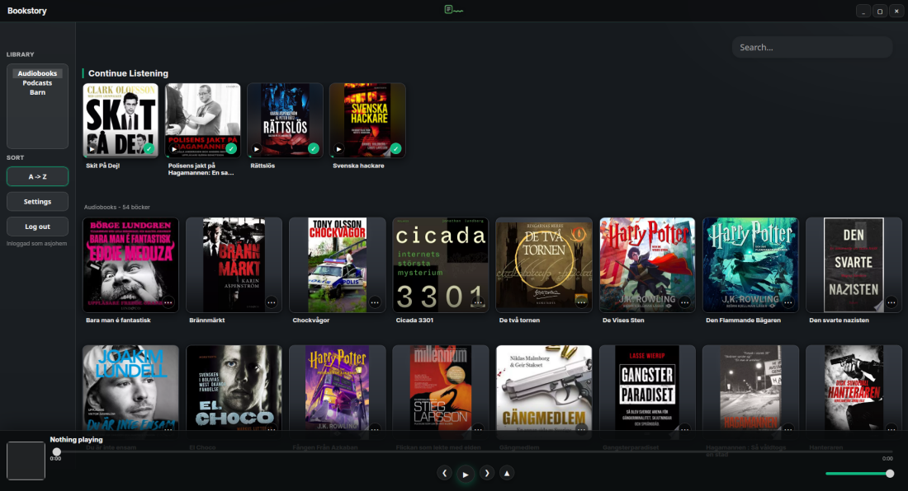

# Bookstory

Bookstory is a desktop client for Audiobookshelf, built with Tauri 2, TypeScript, and Rust.



## Quick Start

Requirements:
- Running Audiobookshelf server
- Valid Audiobookshelf account

Development:
```bash
npm install
npm run tauri:dev
```

Build packages:
```bash
npm run tauri:build
```

## Documentation

- [SSO setup (Audiobookshelf + Authentik + Nginx Proxy Manager)](docs/sso.md)
- [Offline listening](docs/offline.md)
- [Audio codec requirements](docs/audio-codecs.md)
- [Platform compatibility](docs/platform.md)
- [Releases and installation](docs/releases.md)
- [Changelog](CHANGELOG.md)

## Core Features

- Global search across books and podcasts
- Continue Listening and Play Next shelves
- Mini player and full-screen now playing
- Progress sync and mark played/unplayed
- Offline downloads with queued offline progress sync
- Localized UI (English, Swedish, German)

## Bug Reports and Feedback

Open issues here:
- https://github.com/kaptensea/bookstory/issues

When reporting bugs, include:
- Expected behavior
- Actual behavior
- OS and session type (X11/Wayland)
- Repro steps

## License

MIT
